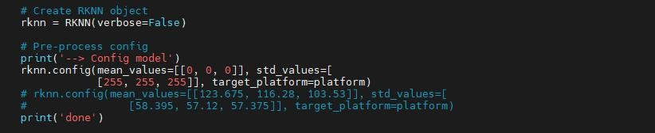

### 1、如何确定设备是否支持自定义算法？

- 版本 ≥3.2.1，支持自定义推理代码&后处理代码
- 版本＜3.2.1,支持自定义后处理代码


### 2、如何查看产品型号？

下图系统设置-设备升级中的ks968为产品型号


### 3、模型量化中platform如何确定？

- 版本中ks968，platform为rk3588
- 版本中ks916，platform为rk3568

### 4、设备中的全部示例算法包在哪下载？

[点此下载]( https://pan.baidu.com/s/1xNDw1ns9Ra90xlOfP9LF1A?pwd=0000 )。下载对应产品型号，对应语言、对应版本的demo文件夹。如我购买的产品是中文版ks968-m2-3.2.1，则下载：ks968-m1&m2->标准算法仓->中文算法包->V3.2.1->demo文件夹。


### 5、如何调试代码&查看日志？

- 在下图所示红色框内，连续点击7次，打开开发者模式（版本≥3.1.6具备此功能）


- 在高级设置，终端管理中，可进入盒子后台调试&查看日志（请勿删除系统源码，谨慎操作，否则造成设备不可用）


- 调试代码。导入`logger`包，使用`LOGGER.info`输出日志。示例如下。

```python
from logger import LOGGER

LOGGER.info('boxes:{},classes:{},scores:{}'.format(boxes, classes, scores))
```

- 查看日志。

查看推理模块日志。

```bash
tail -f ks/ks968/data/logs/engine/0/engine.log
```


查看后处理模块日志。

```bash
tail -f ks/ks968/data/logs/filter/filter.log
```


### 6、自定义算法包不告警，怎么办？

算法包已正确导入到智能分析设备，但是不产生告警，排查方法如下。

1. 首先，按照对应示例算法包配置文件中的修改要求，逐一检查配置文件是否修改正确。


2. 如果修改正确。按照上述【调试代码&查看日志】中的方法，查看engine与filter日志。

- 查看engine日志，查看是否报错。如下推理报错，显示`zql_classify.py`中第37行出现错误。并给出了错误类型，可通过添加日志调试修复。


- 查看filter日志，查看是否报错。如下后处理报错，显示`fog.py`中第91行出现错误。并给出了错误类型，可通过添加日志，调试修复。


3. 如果算法推理（engine）与后处理（filter）日志均正常，但是依然没有告警结果。

- 排查量化时，均值、方差等参数是否正确修改。



- 排查onnx的转换问题，如需保持静态输入输出。

- 使用未经转换的原始训练文件，推理看模型能否检测出目标。
